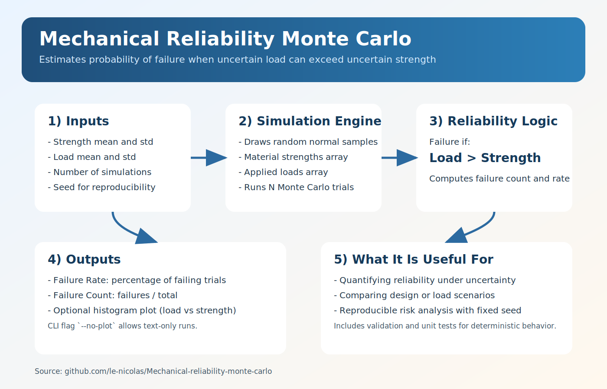

# Monte Carlo MES
Monte Carlo reliability simulation for mechanical systems.

This project estimates failure probability when applied loads can exceed material strength under uncertain conditions.



## Features
- Reproducible Monte Carlo runs with configurable random seed.
- CLI parameters for means, standard deviations, and simulation count.
- Optional histogram plot to compare load and strength distributions.
- Unit tests for validation and deterministic behavior.

## Quick Start
```powershell
git clone https://github.com/le-nicolas/Monte_carlo_MES.git
cd Monte_carlo_MES
python -m venv .venv
.venv\Scripts\Activate.ps1
pip install -r requirements.txt
python main.py --no-plot
```

## CLI Usage
```powershell
python main.py [options]
```

Available options:
- `--material-strength-mean` (default: `100`)
- `--material-strength-std` (default: `10`)
- `--load-mean` (default: `90`)
- `--load-std` (default: `15`)
- `--num-simulations` (default: `10000`)
- `--seed` (default: `42`)
- `--no-plot` (skip matplotlib output)

Example with custom inputs:
```powershell
python main.py --material-strength-mean 110 --load-mean 95 --num-simulations 50000 --seed 7
```

## Output
The script prints:
- Failure rate (%)
- Failure count (`failures / total simulations`)

When plotting is enabled, it also displays overlaid histograms for:
- Material strength samples
- Applied load samples

## Development
Install test dependencies and run tests:
```powershell
pip install -r requirements-dev.txt
pytest
```

## Model Assumption
This implementation assumes both strength and load are normally distributed and independent.
